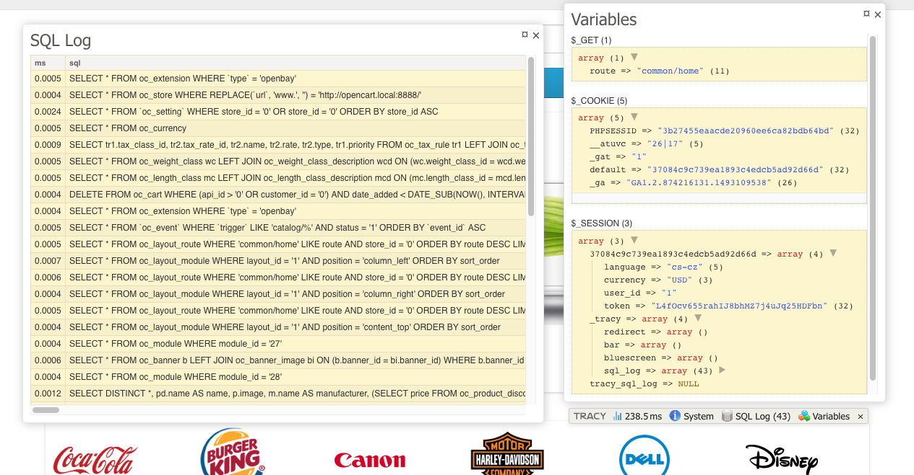

# Tracy Debugger Toolbar for [OpenCart 2.x](https://github.com/opencart/opencart)

"Tracy: the addictive tool to ease debugging PHP code for cool developers. Friendly design, logging, profiler, advanced features like debugging AJAX calls or CLI support. You will love it."
For more information see official [Tracy repository](https://github.com/nette/tracy)




## Installation

1. Requiring installed [vQmod](https://github.com/vqmod/vqmod) because vQmod doesn't support installing via composer itself.
2. `composer require burdapraha/oc_tracy`
3. `composer require sasedev/composer-plugin-filecopier` for files manipulating
4. Add this code to your composer.json project file, extra section:

```
    "extra": {
        "filescopier": [
            {
                "source": "vendor/burdapraha/oc_tracy/upload",
                "destination": "upload",
                "debug": "true"
            }
        ]
    }    
```
    
It will move vqmod xml file to correct folder.

5. add constant `define('DEV', true);` to your config.php, /admin/config.php
6. optionally you can add row to your `.gitignore` file with path to tracy.xml (example: upload/vqmod/xml/tracy.xml)
7. celebrate!

## Optional settings

Constants to config.php, /admin/config.php:
- [DEV_EMAIL](https://github.com/nette/tracy#production-mode-and-error-logging) for notification about bugs in production mode
- [DEV_EDITOR](https://pla.nette.org/en/how-open-files-in-ide-from-debugger#toc-mac-os-x) for one-click open file, row with bug from "bluescreen"